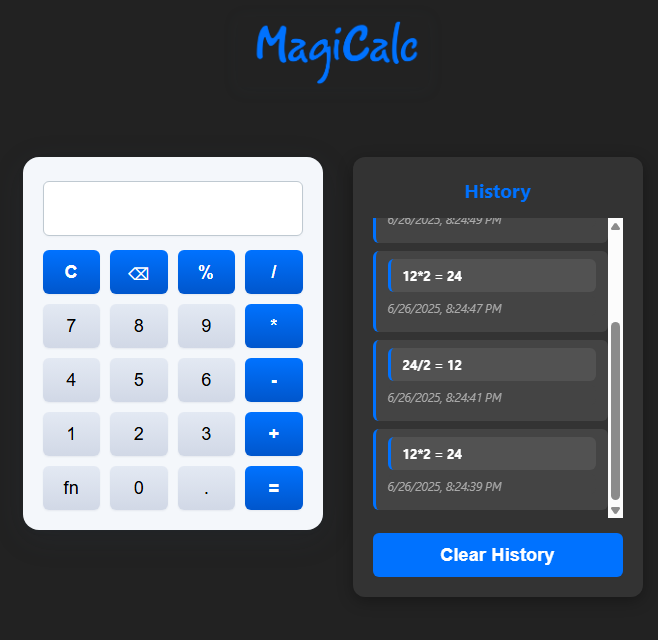

# MagiCalc

MagiCalc is a simple offline calculator web app.

## Features
- Basic arithmetic operations (addition, subtraction, multiplication, division, percent)
- Calculation history panel to show your latest calculations
- History is saved in your browser's local storage, so it persists between sessions
- Mobile-friendly design

## Screenshot

## Usage
Just open `index.htm` in your browser and start calculating!

---

This project is open source and available on [GitHub](https://github.com/sobhan-shahamatnia/magicalc). 